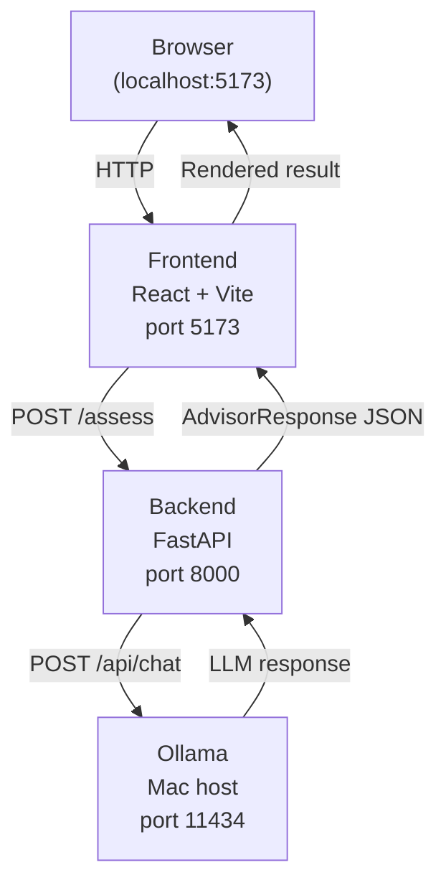
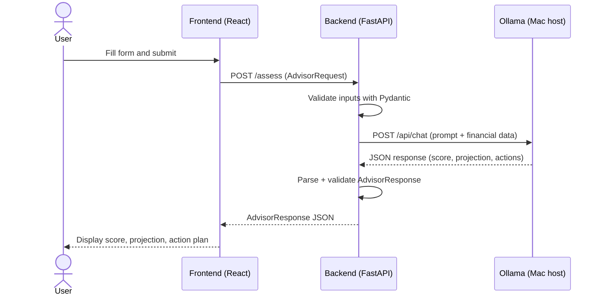

# Retirement Readiness Advisor

An AI-powered UK retirement readiness tool. Enter your age, salary, pension pot, contributions, and retirement goal — and receive an AI-generated readiness score, financial projection, and personalised action plan.

---

## Problem Statement

- Many individuals are uncertain whether their current pension savings and contributions are sufficient for a comfortable retirement
- There is no simple, accessible tool that gives a clear, personalised picture of retirement readiness without requiring a financial adviser
- People lack actionable guidance on whether to increase contributions or seek professional advice before it is too late

## Solution

- Built a web application that accepts key financial inputs (age, salary, pension pot, contributions, retirement goal) and runs actuarial calculations augmented by a large language model
- The LLM synthesises the numbers into a plain-English readiness score, a projected retirement pot, and a prioritised action plan — all within seconds
- Runs entirely on local hardware via Ollama, keeping personal financial data private

## Benefits

- Gives users an instant, personalised snapshot of their retirement trajectory
- Highlights whether contributions need to increase and by how much
- Surfaces when professional financial advice would add the most value
- Empowers informed, long-term financial decision-making without specialist knowledge

## Future Scope

- **Conversational interface** — allow users to ask follow-up questions in plain language and receive contextual, jargon-free explanations
- **Scenario modelling** — let users simulate different contribution rates, retirement ages, or investment returns and compare outcomes
- **Persistent profiles** — save and revisit projections over time to track progress toward retirement goals

---

## Tech Stack

| Layer | Technology |
|---|---|
| Frontend | React + Vite, Tailwind CSS |
| Backend | Python, FastAPI, Pydantic, uvicorn |
| HTTP client | httpx |
| LLM runtime | Ollama (`gpt-oss:120b-cloud`) |
| Infrastructure | Docker + Docker Compose |

---

## Architecture

Three services wired together with Docker Compose:



---

## Sequence Diagram



---

## API Endpoints

### `GET /health`
Returns service status and the active model name. Used to verify the backend is running and correctly wired to Ollama.

**Response:**
```json
{ "status": "ok", "model": "gpt-oss:120b-cloud" }
```

---

### `POST /assess`
Accepts a user's financial profile and returns an AI-generated retirement readiness assessment.

**Request body:**
| Field | Type | Description |
|---|---|---|
| `age` | integer | Current age (18–79) |
| `retirement_age` | integer | Target retirement age (51–80) |
| `current_salary` | float | Annual gross salary in GBP |
| `current_pot` | float | Current pension pot value in GBP |
| `monthly_contribution` | float | Monthly employee pension contribution in GBP |
| `employer_contribution` | float | Monthly employer pension contribution in GBP |
| `retirement_income_goal` | float | Desired annual retirement income in GBP |

**Response body:**
| Field | Type | Description |
|---|---|---|
| `readiness_score` | integer | Score from 0–100 |
| `readiness_label` | string | `"On track"`, `"Needs attention"`, or `"At risk"` |
| `projected_pot` | float | Estimated pot at retirement in GBP |
| `projected_annual_income` | float | Estimated annual drawdown income in GBP |
| `shortfall` | float | Gap between goal and projection in GBP (negative = surplus) |
| `years_to_retirement` | integer | Years remaining until target retirement age |
| `summary` | string | Plain-English narrative from the LLM |
| `action_steps` | array | Up to 4 prioritised actions (`high`, `medium`, `low`) each with `action` and `reason` |
| `disclaimer` | string | Standard financial advice disclaimer |

## Prerequisites

- [Docker Desktop](https://www.docker.com/products/docker-desktop/) installed and running
- Ollama installed on Mac:
  ```bash
  brew install ollama
  ```
- Model pulled:
  ```bash
  ollama pull gpt-oss:120b-cloud
  ```

## How to run

**Step 1:** Start Ollama on your Mac (runs outside Docker):
```bash
ollama serve
```

**Step 2:** Pull the model if not already done:
```bash
ollama pull gpt-oss:120b-cloud
```

**Step 3:** Start the full app with one command:
```bash
docker compose up --build
```

**Step 4:** Open [http://localhost:5173](http://localhost:5173) in your browser.

---

## Running backend locally without Docker (for development)

```bash
cd backend
uv sync
uv run uvicorn app.main:app --reload
```

## Running frontend locally without Docker

```bash
cd frontend
npm install
npm run dev
```

---

## Project structure

```
retirement-advisor/
├── docker-compose.yml
├── .env.example
├── README.md
│
├── frontend/
│   ├── Dockerfile
│   ├── package.json
│   ├── vite.config.ts
│   ├── tailwind.config.js
│   ├── tsconfig.json
│   ├── index.html
│   └── src/
│       ├── main.jsx
│       ├── App.jsx
│       ├── index.css
│       ├── api/
│       │   └── advisor.ts
│       ├── types/
│       │   └── advisor.ts
│       └── components/
│           ├── AdvisorForm.jsx
│           ├── ResultCard.jsx
│           └── LoadingSpinner.jsx
│
├── backend/
│   ├── Dockerfile
│   ├── pyproject.toml
│   └── app/
│       ├── __init__.py
│       ├── main.py
│       ├── router.py
│       ├── models.py
│       ├── llm.py
│       └── config.py
```

---
